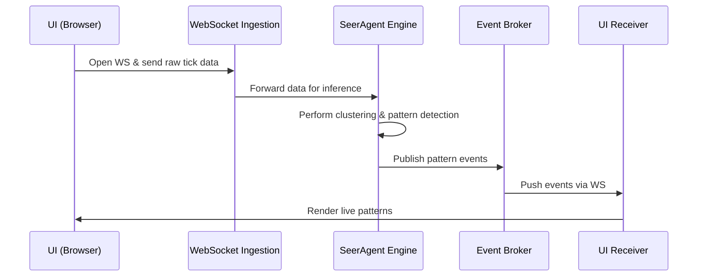

# Real-Time SeerAgent Architecture

**Date:** 2025-04-29

## Overview
This document outlines the components and flow for the real-time SeerAgent streaming pipeline, enabling live pattern detection and UI updates.

## Components
- **WebSocket Ingestion Service**: FastAPI server handling live data streams from clients.
- **SeerAgent Inference Engine**: Core module processing time-series data, clustering patterns in real time.
- **Event Broker**: Redis Pub/Sub (or Kafka) for decoupled event routing.
- **UI WebSocket Client**: Front-end component receiving events and updating visualizations.
- **Kubernetes Deployment**: Helm charts and manifests for scalable, fault-tolerant deployment.

## Sequence Diagram


## Next Steps
- Review and finalize architecture.
- Define message schemas and validation.
- Implement WebSocket service stub in `wave/ingest.py`.

## Message Schemas
### Ingestion Payload
```json
{
  "symbol": "BTCUSD",
  "timestamp": 1618300000,
  "price": 54321.0,
  "volume": 1.234
}
```
### Pattern Event
```json
{
  "pattern_id": "uuid-v4",
  "symbol": "BTCUSD",
  "start_ts": 1618300000,
  "end_ts": 1618300060,
  "pattern_type": "double_top",
  "confidence": 0.95
}
```

## Error Handling
- Validate incoming payload against schema, respond with WS close code 1003 on invalid JSON.
- Log and drop messages that fail inference.
